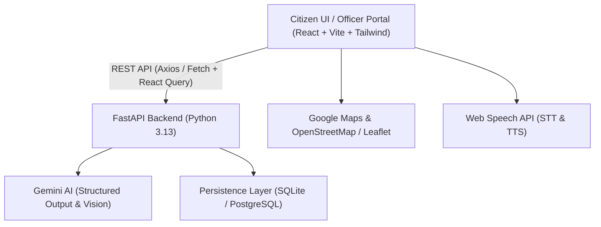

# CivicGrid — AI-Powered Civic Complaint Intelligence Platform
## Comprehensive Project Report & Feature Specification

---

## 1. Executive Summary

**CivicGrid** is a modern civic intelligence and municipal grievance platform designed to bridge the communication gap between citizens and local administrative bodies. Leveraging Google Gemini Multimodal AI, interactive geospatial mapping, and multilingual natural language processing, CivicGrid automatically categorizes, prioritizes, deduplicates, and tracks civic issues in real time.

Citizens can report problems (potholes, water leaks, garbage overflow, power outages) via voice, text, or photo in their native regional language. Municipal officers receive a centralized, prioritized dashboard with analytics, maps, and workflow management tools to resolve public complaints efficiently.

---

## 2. Technology Stack & Architecture

### 2.1 Frontend
- **Framework**: React 19 + TypeScript + Vite.
- **Styling**: Tailwind CSS with custom CSS variables (Light & Dark theme support).
- **Data Fetching & State**: TanStack React Query v5 with automatic retries and exponential backoff.
- **Mapping**: Google Maps JavaScript API (MarkerClusterer, Places Autocomplete, Geocoding) with fallback to OpenStreetMap/Leaflet.
- **Visualization**: Recharts (Dynamic Bar, Pie, and Donut charts).
- **Localization**: Custom lightweight i18n engine supporting 9 languages.
- **Accessibility**: Web Speech API for voice recognition (Speech-to-Text) and audio readout (Text-to-Speech).

### 2.2 Backend
- **Framework**: FastAPI (Asynchronous Python REST API).
- **AI Engine**: Google GenAI SDK (`gemini-3.6-flash`) with structured JSON schema output and vision parsing.
- **Database Engine**: Dual-engine persistence layer supporting local/embedded **SQLite (WAL mode)** and cloud **PostgreSQL** (Neon, Supabase, Render).
- **Security & Cryptography**: PBKDF2-HMAC-SHA256 with 100,000 iterations for officer credentials; parameterized SQL queries.

---

## 3. Comprehensive Feature Catalog

### 🌟 3.1 Citizen Issue Reporting & AI Extraction
1. **Multimodal Complaint Submission**:
   - Citizens can submit issues by typing text, uploading on-site photos, or speaking via microphone.
   - Base64 image payload integration sends photos directly into Gemini vision models for defect confirmation.
2. **Multilingual Voice-to-Text (STT)**:
   - Built-in speech recognition supporting Indian accents and regional languages.
   - Real-time speech transcription directly into the reporting form.
3. **Text-to-Speech (TTS) Accessibility**:
   - Audio playback button on complaint summaries and details for visually impaired or non-literate citizens.
4. **Interactive Location Selection**:
   - **Google Places Search**: Live predictive autocomplete for streets, landmarks, and postal codes.
   - **Pin Drop Map**: Click-to-place map marker that reverse-geocodes coordinates into human-readable addresses.
   - **GPS Geolocation**: One-click "Detect My Current Location" button.
5. **Zero-Touch AI Classification (Gemini)**:
   - **Category & Subcategory**: Automated categorization into 11 civic domains (Roads, Water, Electricity, Waste Management, Public Transport, Healthcare, Education, Street Lighting, Drainage, Public Safety, Other).
   - **Severity Assessment**: Ranks impact from `Low`, `Medium`, `High`, to `Critical`.
   - **Urgency Level**: Classifies urgency from `Routine`, `Soon`, `Urgent`, to `Emergency`.
   - **Facility Extraction**: Identifies affected public infrastructure (e.g., "Transformer #4", "Bus Stop").
   - **Executive Summary**: Generates concise, professional incident summaries from conversational user input.
   - **Spam & Abuse Filtering**: Detects gibberish, profanity, or irrelevant inputs, automatically tagging them as `Rejected / Spam`.

---

### 🔍 3.2 Intelligent Fuzzy Duplicate Detection & Escalation
1. **Multi-Factor Location Matching**:
   - Evaluates complaints without requiring exact word-for-word string equality.
   - **PIN Code + Landmark Matching**: Identifies shared 6-digit Indian PIN codes and area tokens (e.g., `"MG Road, Indiranagar, Jaipur 302006"` matches `"Near MG Road market, 302006"`).
   - **GPS Proximity Radius**: Coordinates within 500 meters automatically flag duplicate open issues.
   - **Token Overlap & Substrings**: Normalizes and compares meaningful landmark tokens while ignoring generic stop words (*ward, sector, road, street, near*).
2. **Unified Citizen Endorsements**:
   - Duplicate complaints are merged in-place into the original complaint rather than cluttering the system with duplicate cards.
   - New reports increment the `citizen_reports_count` (e.g., `🔥 5 Citizen Reports`).
   - Additional text and photos are preserved under **"👥 Additional Citizen Endorsements & Updates"** in the complaint timeline.
3. **Automatic Severity & Urgency Escalation**:
   - As citizen report counts pass critical thresholds ($\ge 2, \ge 3, \ge 5$ reports), severity and urgency automatically escalate to `High` or `Critical`.

---

### 📋 3.3 Complaints Directory & Incident Management
1. **Filterable Complaints Explorer**:
   - Multi-criteria filtering by Status, Category, Severity, Urgency, and Location.
   - Instant search across summaries, raw text, and subcategories.
   - Sorting by Newest, Oldest, Highest Severity, and Highest Urgency.
   - Responsive Toggle: Switch between **Card Grid View** and **Data Table View**.
2. **Comprehensive Complaint Details Page**:
   - Displays complete AI metadata, raw complaint text, coordinates, visual badges, and image attachments.
   - Interactive mini-map pin showing exact issue location.
   - Endorsements timeline tracking cumulative citizen reports.
3. **Officer Workflow Actions**:
   - Status update dropdown: `New` $\rightarrow$ `Under Review` $\rightarrow$ `Assigned` $\rightarrow$ `In Progress` $\rightarrow$ `Resolved` $\rightarrow$ `Rejected / Spam`.
   - Permanent complaint deletion with confirmation dialog.

---

### 🗺️ 3.4 Interactive Civic GIS Map View
1. **Geospatial Map Canvas**:
   - Plots all geocoded complaints across the municipality.
   - Color-coded severity pins (Red: Critical, Orange: High, Amber: Medium, Gray: Low).
2. **Interactive Information Windows**:
   - Clicking any pin displays a summary popup with status badges, photo preview, and direct link to the details page.
3. **Real-time Map Filters**:
   - Filter map markers by category, severity, urgency, and status with live badge counters.

---

### 📊 3.5 Analytics & Municipal Performance Dashboard
1. **KPI Summary Cards**:
   - Total Complaints, Open Issues, High-Priority Alerts, and Resolved Rate.
2. **Real-Time Interactive Visualizations**:
   - **Category Distribution**: Bar chart comparing complaint volumes across civic departments.
   - **Severity Breakdown**: Donut chart displaying Low / Medium / High / Critical proportions.
   - **Urgency Distribution**: Color-coded bar chart tracking response urgency levels.
3. **Spam-Filtered Metrics**:
   - All charts, KPIs, and aggregations compute exclusively from valid, non-rejected complaints.

---

### 🌐 3.6 Multilingual Support (i18n)
CivicGrid provides full UI translation across **9 languages**:
- 🇬🇧 **English (en)**
- 🇮🇳 **Hindi (hi)** — हिन्दी
- 🇮🇳 **Bengali (bn)** — বাংলা
- 🇮🇳 **Tamil (ta)** — தமிழ்
- 🇮🇳 **Telugu (te)** — తెలుగు
- 🇮🇳 **Kannada (kn)** — ಕನ್ನಡ
- 🇮🇳 **Malayalam (ml)** — മലയാളം
- 🇮🇳 **Marathi (mr)** — मराठी

---

### 🔐 3.7 Role-Based Access Control (RBAC) & Security
1. **Role Separation**:
   - **Citizen Mode**: Public access for browsing complaints, viewing maps, reading analytics, and submitting issues.
   - **Officer Mode**: Restricted municipal administration portal enabling status progression, incident assignment, and record deletion.
2. **Cryptographic Authentication**:
   - Officer passwords stored using PBKDF2 with SHA-256 and salt over 100,000 rounds.
   - In-app password change feature.
   - Zero hardcoded secrets in repository.
3. **Resilience & Protection**:
   - **SQL Injection Prevention**: Parameterized queries across all database operations.
   - **Render Free Tier Cold-Start Recovery**: Automatic client-side retry with backoff for HTTP 502/503/504.
   - **Cross-Origin Resource Sharing (CORS)**: Configurable origin whitelists with global preflight `OPTIONS` handlers.

---

## 4. Database Schema

### 4.1 `complaints` Table
| Column Name | Type | Description |
|---|---|---|
| `id` | `TEXT PRIMARY KEY` | Formatted identifier (e.g. `COMP-2026-0001`) |
| `raw_text` | `TEXT NOT NULL` | Original user complaint text |
| `category` | `TEXT NOT NULL` | Main civic department category |
| `subcategory` | `TEXT NOT NULL` | Specific issue classification |
| `severity` | `TEXT NOT NULL` | `Low` \| `Medium` \| `High` \| `Critical` |
| `urgency` | `TEXT NOT NULL` | `Routine` \| `Soon` \| `Urgent` \| `Emergency` |
| `location` | `TEXT NOT NULL` | Ward name, landmark, or street address |
| `affected_facility`| `TEXT NOT NULL` | Associated infrastructure |
| `summary` | `TEXT NOT NULL` | AI-generated summary |
| `status` | `TEXT NOT NULL` | Lifecycle state (`New`, `In Progress`, etc.) |
| `created_at` | `TEXT NOT NULL` | ISO 8601 UTC timestamp |
| `updated_at` | `TEXT NOT NULL` | ISO 8601 UTC timestamp |
| `latitude` | `REAL` | Geographic latitude |
| `longitude` | `REAL` | Geographic longitude |
| `image_url` | `TEXT` | Base64 or cloud image URI |
| `image_analysis` | `TEXT` | AI vision analysis of the scene |
| `is_duplicate` | `INTEGER` | `1` if duplicate, `0` if primary |
| `duplicate_of_id` | `TEXT` | ID of original complaint if duplicate |
| `citizen_reports_count` | `INTEGER` | Cumulative citizen support count |
| `additional_updates` | `TEXT` | JSON array of subsequent reports & updates |

### 4.2 `officers` Table
| Column Name | Type | Description |
|---|---|---|
| `officer_id` | `TEXT PRIMARY KEY` | Officer ID (e.g. `OFFICER-2026`) |
| `password_hash` | `TEXT NOT NULL` | PBKDF2-HMAC-SHA256 password hash |
| `name` | `TEXT NOT NULL` | Officer full name |
| `department` | `TEXT NOT NULL` | Assigned municipal department |
| `created_at` | `TEXT NOT NULL` | ISO 8601 UTC timestamp |

---

## 5. REST API Specification

| Method | Endpoint | Description | Auth Level |
|---|---|---|---|
| `POST` | `/api/complaints` | Submit and classify complaint | Public |
| `GET` | `/api/complaints` | Filter, search & paginate complaints | Public |
| `GET` | `/api/complaints/{id}` | Retrieve complaint by ID | Public |
| `PATCH` / `PUT`| `/api/complaints/{id}` | Update complaint status | Officer |
| `DELETE` | `/api/complaints/{id}` | Permanently delete complaint | Officer |
| `GET` | `/api/complaints/stats`| Aggregate KPI counts | Public |
| `POST` | `/api/officer/login` | Authenticate municipal officer | Public |
| `POST` | `/api/officer/change-password` | Update officer password | Officer |
| `GET` | `/api/health` | Health & liveness probe | Public |

---

## 6. Verification & Quality Assurance

- **Backend Test Suite**: **28 passing unit & integration tests** (`pytest tests/`) validating schemas, classifier fallback, duplicate merging, SQL queries, and endpoints.
- **Frontend Build**: Production bundle builds with **0 errors in 1.26s** (`tsc -b && vite build`).
- **Deployments**: Live on **Vercel** (Frontend) and **Render** (Backend).
